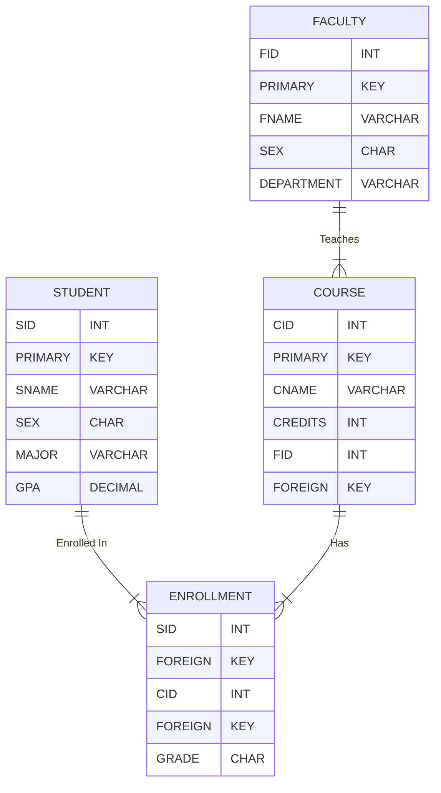

# 🎓 SQL Project: Student Information System 🚀


---

## 📊 **Database Schema**

Below is the structure of the database:  


## Overview

This project focuses on the implementation of a **Student Information System** using **SQL**. It covers database creation, table management, data insertion, and query-based operations. The project is ideal for learning SQL concepts like DDL, DML, query filtering, joins, aggregate functions, views, and table modifications.

## Objectives

- Design and implement a university-based **Student Information System**.
- Understand table relationships and normalization (3NF).
- Practice creating databases, tables, and performing complex SQL queries.

## Database Structure

The project includes **4 main tables**:

1. **STUDENT**  
   Stores details of university students.  
   - **Columns:** `SID`, `SNAME`, `SEX`, `MAJOR`, `GPA`

2. **FACULTY**  
   Stores faculty member information.  
   - **Columns:** `FID`, `FNAME`, `SEX`, `DEPARTMENT`

3. **COURSE**  
   Details about university courses offered.  
   - **Columns:** `CID`, `CNAME`, `CREDITS`, `FID` (foreign key referencing `FACULTY.FID`)

4. **ENROLLMENT**  
   Tracks which students are enrolled in which courses.  
   - **Columns:** `SID` (foreign key referencing `STUDENT.SID`), `CID` (foreign key referencing `COURSE.CID`), `GRADE`

## Key SQL Operations

- **Database Creation:** `CREATE DATABASE Student_Info_System;`
- **Table Creation:** Using `CREATE TABLE` statements with primary and foreign keys.
- **Data Manipulation:** Insert, update, and delete data using `INSERT`, `UPDATE`, `DELETE`.
- **Queries:**
  - Filtering using `WHERE` clauses.
  - Aggregation using `GROUP BY` and `HAVING`.
  - Joining tables using `INNER JOIN`, `LEFT JOIN`, etc.
  - Subqueries and Views.

## Sample Queries

```sql
-- Retrieve all students with GPA greater than 3.5
SELECT SNAME, MAJOR, GPA 
FROM STUDENT 
WHERE GPA > 3.5;

-- List all courses along with the faculty teaching them
SELECT C.CNAME, F.FNAME 
FROM COURSE C
INNER JOIN FACULTY F ON C.FID = F.FID;

-- Find the number of students enrolled in each course
SELECT CID, COUNT(SID) AS Student_Count
FROM ENROLLMENT
GROUP BY CID;
```
